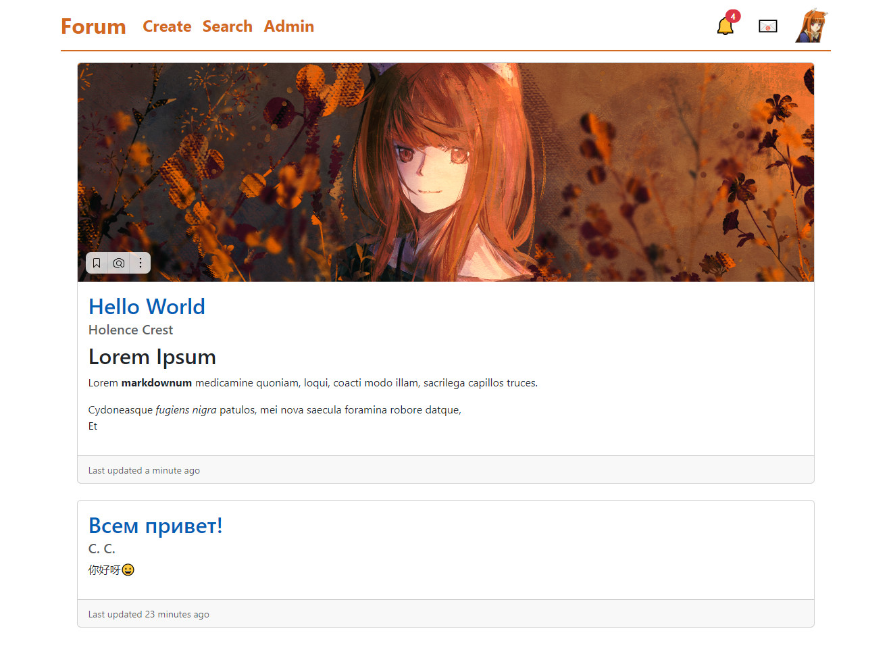
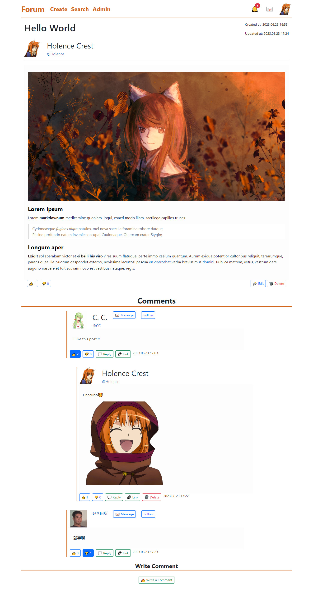

# MyForum

A forum where users can

- post articles and comments with files
- upvote\downvote on articles\comments
- followings \ followers
- messages (PM)
- informations (notifications)

## Build \ Deploy

Change your setting in `.env` file, then `docker compose up`.

## Scrennshots

---

